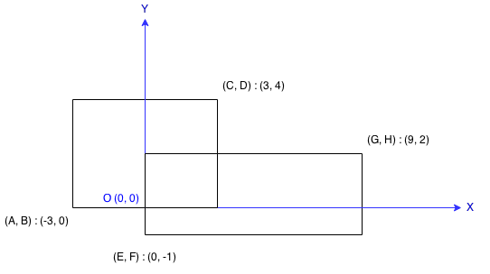

# 223. Rectangle Area My Submissions


Find the total area covered by two rectilinear rectangles in a 2D plane.

Each rectangle is defined by its bottom left corner and top right corner as shown in the figure.



Rectangle Area
Assume that the total area is never beyond the maximum possible value of int.


```java
public class Solution {
    public int computeArea(int A, int B, int C, int D, int E, int F, int G, int H) {
        int a1 = (C-A) * (D-B) ;
        int a2 = (G-E) * (H-F) ;
        if (E >= C || F >= D || B >= H || A >= G) return a1+a2;
        
        int intersect = (Math.min(C, G) - Math.max(A, E)) * (Math.min(D, H) - Math.max(B, F));
        
        return  (a1+a2 - intersect);
    }
}
```
the following python solution is not suitable for java in the case of large number but no overlap.
a pythonic solution:

```python
class Solution:
    # @param {integer} A
    # @param {integer} B
    # @param {integer} C
    # @param {integer} D
    # @param {integer} E
    # @param {integer} F
    # @param {integer} G
    # @param {integer} H
    # @return {integer}
    def computeArea(self, A, B, C, D, E, F, G, H):
        sums = (C - A) * (D - B) + (G - E) * (H - F)
        return sums - max(min(C, G) - max(A, E), 0) * max(min(D, H) - max(B, F), 0)
```